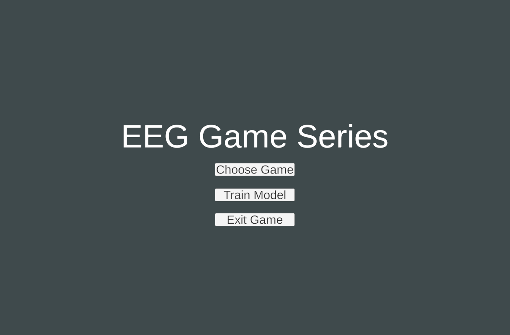
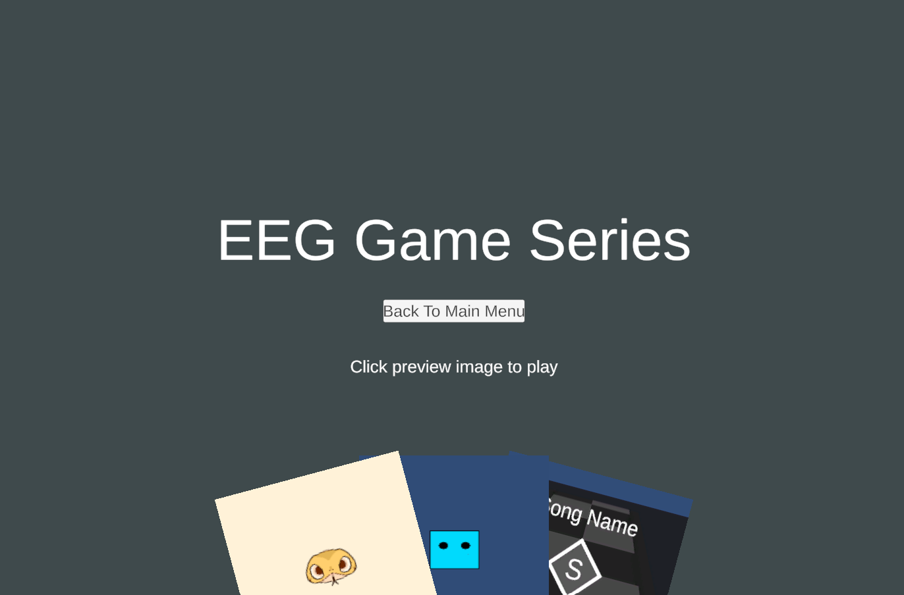
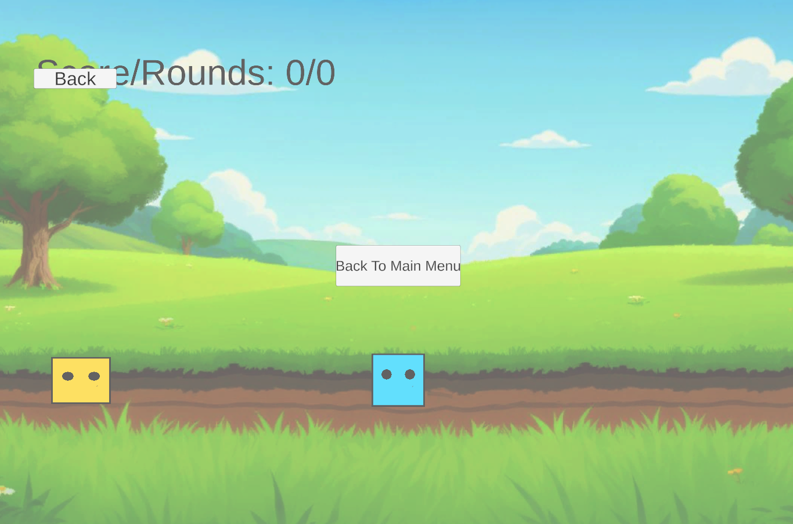
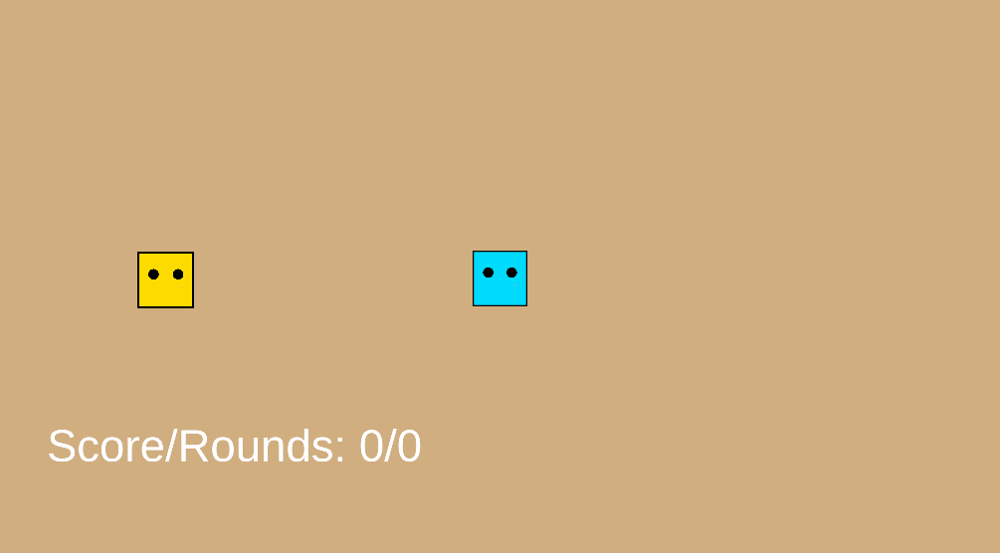
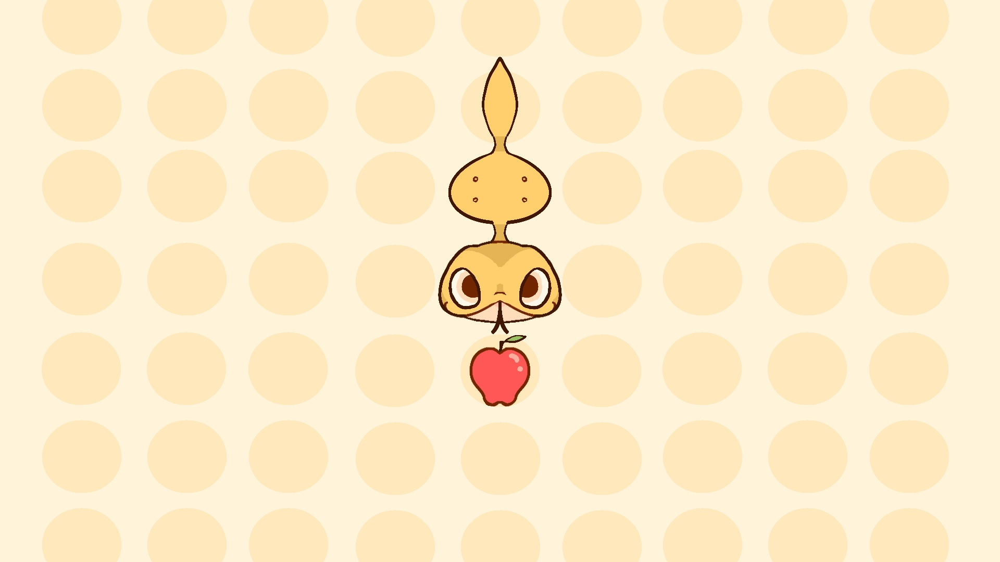
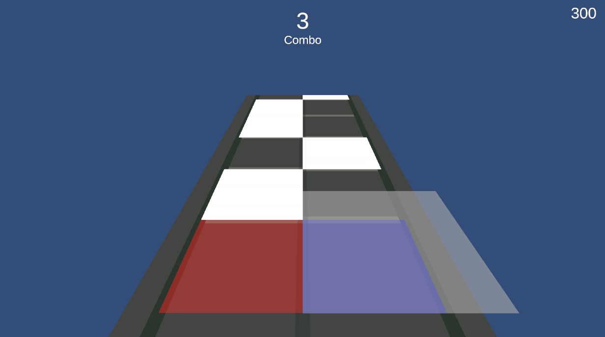

# MindX
An EEG Game pipeline.
1. [How to clone](#how-to-clone-this-project)
2. [Usage](#usage)
3. [How to play the game](#how-to-play-the-game)
4. [Game description](#games-for-eeg)
# How to clone this project
1. `git clone git@github.com:Sapiens-wx/MindX.git` to clone this repository
2. Since this repository has two submodules: a Unity project and a python project for recording EEG data and training models, use `git submodule update --init` to update all submodules to its newest version.
3. If you have cloned this repository __and__ the submodules (which means the above two steps are completed), and want to get the newest version of the two submodules, use `git submodule update --remote --merge`.
# Usage
1. __BulletHell__: this is a unity project containing the source code of three custom-developed games specifically designed for EEG game control experiments.
2. __EEG_CNN__: this is a pipeline helping researchers from collecting EEG data using Muse lsl, preprocessing EEG, classifying EEG, predicting EEG in real time, to streaming the realtime EEG prediction into our custom-developed games.
3. __Build__: this folder contains the executable file (in windows) of the three custom developed games.

A detailed instruction is written in each submodule's `README.md` file.

# How to play the game
If you don't want to access the source code and just want to play the game, goto the `/build` directory and click on `BulletHell3.exe.`

### Main Menu

Once you are in the game's main menu, click "choose game" to select one of the three games to play.

### Choose Game

After you clicked "choose game" in the main menu, you will need to select a game by clicking on one of the three cards at the bottom of the screen. Choose the one you want to play.

### In the game

When you want to exit the current game and choose another game, press `esc` and click "Back to Main Menu". 

# Games For EEG
This section contains a brief introduction to each of the three games.
1. [Hide And Seek](#hide-and-seek)
2. [Fruit-Lover Snake](#fruit-lover-snake)
2. [Rhythm Game](#rhythm-game)

## Hide And Seek

- **Objective**: quickly catch the child character that briefly appears on the left or right side.
- **Controls**: Press **A** and __D__ to move left and right, respectively.
- **Gameplay**:
  - The player remains centered in the middle of the screen.
  - The child character will briefly appear on either the left or right side.
  - Quickly press the corresponding key (A for left, D for right) to catch the child character.
  - Timing and quick reactions are key to scoring points.

### Parameters
The above parameters can be adjusted to adapt to different situations.

__GameManager.cs__
|Variable Name|Description|
|-|-|
|Rest Interval|Rest time between each round in second|
|Appear Duration|How long is each round in seconds|

__PlayerCtrl.cs__
|Variable Name|Description|
|-|-|
|Walk Duration|How long will it take for the avatar to walk from the middle to the leftmost position (in seconds)|
|Correct Movement|True: player cannot move in the opposite direction. False: player can move in the opposite direction|

## Fruit-Lover Snake

- **Objective**: Control the snake to grow by eating fruit while avoiding collisions with itself.
- **Controls**: Use **W**, **A**, **S**, and **D** to control the snake's movement (up, left, down, right).
- **Gameplay**:
  - The snake moves automatically.
  - Guide the snake to consume fruit that appears on the screen.
  - Each fruit consumed makes the snake longer.
  - Avoid the snake colliding with itself, or the game ends.

## Rhythm Game

- **Objective**: Score points by pressing the left or right input as notes reach the detection zone.
- **Controls**: Press **A** and __D__ for left and right, respectively.
- **Gameplay**:
  - Notes will fall in sync with the music.
  - When a note reaches the detection zone, press the corresponding input (A or D) to hit the note.
  - Score points based on timing and accuracy.